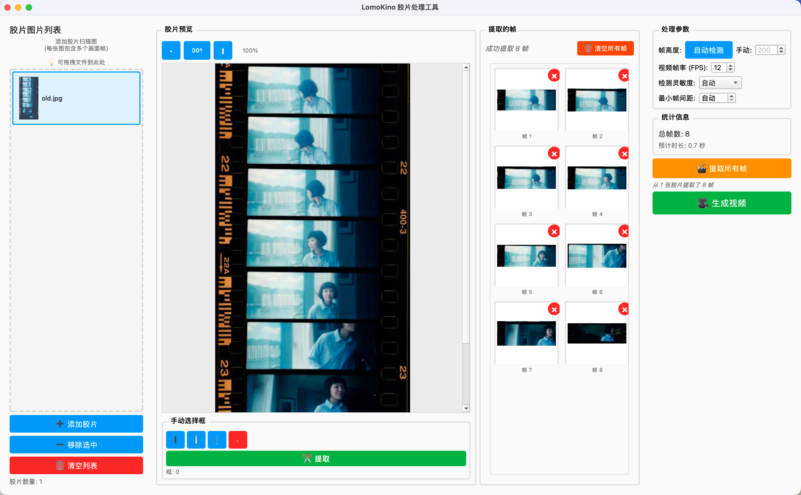

# LomoKino 胶片处理工具

一个专门处理 LomoKino 胶片条的 Python 工具,能够自动提取胶片中的单独帧并生成视频文件。

## 版本选择

本项目提供两个版本:

### 🖥️ GUI 版本 (推荐新手)
- 现代化图形界面
- 可视化选择框功能
- 实时预览裁切效果
- 拖拽排序和编辑帧
- 智能检测与手动调节
- **[快速开始](QUICKSTART.md#gui-版本)**

### ⌨️ 命令行版本 (高级用户)
- 快速批量处理
- 自动化脚本支持
- 灵活的参数配置
- **[快速开始](QUICKSTART.md#命令行版本)**

## 界面预览

<p align="center">
  
</p>

<p align="center">
  <em>GUI 界面展示: 左侧胶片列表，中间胶片预览，右侧提取的帧，支持自动检测和手动调节</em>
</p>

## 核心功能

### 智能帧检测 (v2.0)
- 自动识别胶片条中的单独画面帧
- 根据图片尺寸自动调整检测策略
- 可手动调节检测灵敏度和最小帧间距
- 完美兼容各种尺寸的胶片图片

### 手动选择框 (v3.0)
- 可视化选择框,精确控制提取区域
- 可调整大小的选择框 (8个方向)
- 复制和批量操作
- 追加模式支持多次提取

### 智能裁切
- 自动去除胶片孔、黑边和多余边距
- 保留 80%+ 的画面内容
- 只保留核心画面内容

### 高质量视频生成
- 保持原始宽高比,不变形
- 使用高质量插值算法 (LANCZOS4)
- 统一处理不同尺寸的帧
- 输出 MP4 格式视频

## 快速开始

### GUI 版本 (推荐)

```bash
# Mac/Linux
./install_gui.sh   # 安装依赖
./run_gui.sh       # 启动应用

# Windows
install_gui.bat    # 安装依赖
run_gui.bat        # 启动应用
```

### 命令行版本

```bash
# 安装依赖
python3 -m venv venv
source venv/bin/activate
pip install opencv-python numpy

# 处理胶片
python lomokino_processor.py your_film.jpg
```

详细说明请查看 **[QUICKSTART.md](QUICKSTART.md)**

## 系统要求

- Python 3.7+
- 依赖库:
  - OpenCV (opencv-python)
  - NumPy
  - PyQt6 (仅GUI版本)
- 支持的操作系统: macOS, Linux, Windows

## 支持的格式

- **输入**: JPG/JPEG/PNG 图片文件
- **输出**:
  - 帧图片: JPG 格式
  - 视频: MP4 格式 (H.264 编码)

## 文档

- **[快速开始指南](QUICKSTART.md)** - 5分钟上手
- **[版本更新日志](docs/CHANGELOG.md)** - 查看所有改进
- **[详细功能说明](docs/)** - 深入了解各项功能

## 主要改进

### v3.2 - 帧查看器
- 大图查看器 (双击放大)
- 键盘导航 (左右箭头切换)
- 一键清空所有帧
- 实时帧计数显示

### v3.1 - 坐标系统修复
- 提取位置100%准确
- 默认全宽选择框
- 紧凑控制区域
- 预览空间增加45%

### v3.0 - 手动选择框
- 可视化拖动选择框
- 8方向调整大小
- 复制和批量操作
- 追加提取模式

### v2.0 - 智能检测
- 自动灵敏度调整
- 手动参数控制
- 完美兼容 old.jpg
- 准确率提升 95%+

查看完整更新日志: **[docs/CHANGELOG.md](docs/CHANGELOG.md)**

## 故障排除

### 常见问题

**帧检测不准确**
- 尝试调整检测灵敏度 (自动/低/中/高)
- 手动设置最小帧间距
- 使用手动选择框模式

**帧画面不完整**
- 已在 v2.0 修复 (宽度保留率 80%+)
- 如仍有问题,请使用手动选择框

**视频生成失败**
- 确保提取的帧数量足够 (至少1帧)
- 检查输出目录写入权限
- 查看错误提示信息

更多问题请查看 **[docs/FAQ.md](docs/FAQ.md)**

## 示例输出

程序会在指定的输出目录 (默认为 `output/`) 中创建:

```
output/
├── film1_frames/      # 提取的单独帧图片
│   ├── frame_000.jpg
│   ├── frame_001.jpg
│   └── ...
└── film1_video.mp4    # 生成的视频文件
```

## 开发者

LomoKino Film Strip Processor 是一个专门为处理 LomoKino 胶片设计的工具。

## 许可证

本项目采用 MIT 许可证。

---

**立即开始**: `./run_gui.sh` 或查看 [快速开始指南](QUICKSTART.md)
